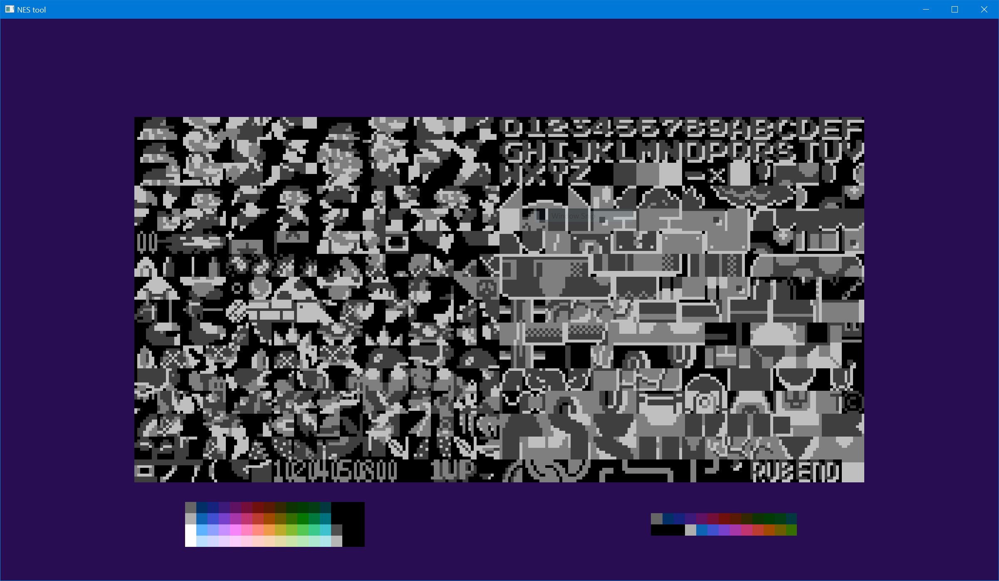

# NES Tool
Rewrite of my `NES` editor in `Rust` and `Vulkan` instead of `C++` and `OpenGL`.
Uses `vulkano`.

To build this application, install the Rust toolchain via https://rustup.rs/ .
After that, use the command: `cargo run` in the project root directory.